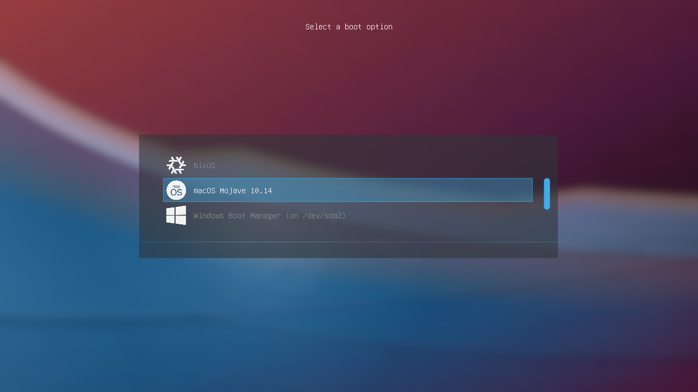
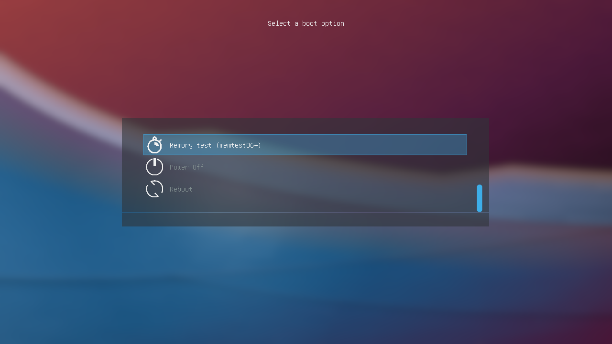
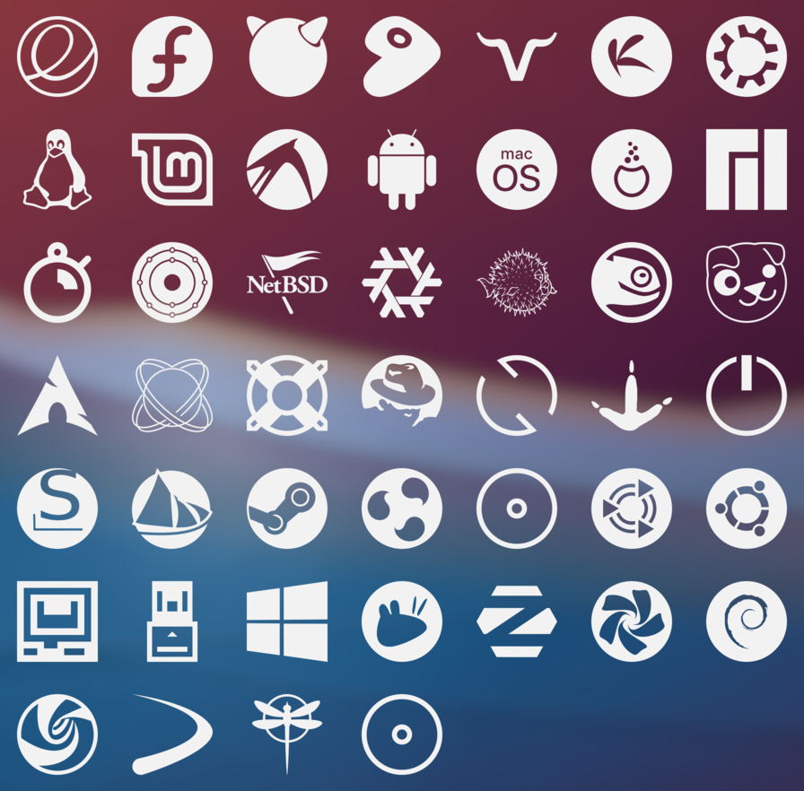

# shuihuo
A minimalistic GRUB theme inspired by shuihuo fork form [Breeze](https://github.com/gustawho/grub2-theme-breeze).

下面的图没有更新，不知道怎么截图，并且增加了字体全是颗粒的问题。

> Keep in mind that the previous screenshots were taken on a low-resolution QEMU virtual machine.

## Installation
Copy the "shuihuo" folder to the themes directory in /boot. If you don't know how to do it, just run the included "install.sh" script as root.
